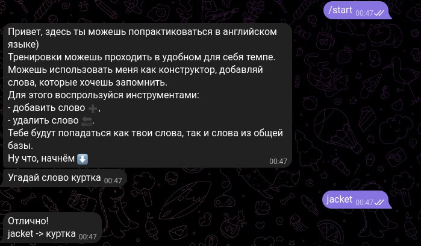
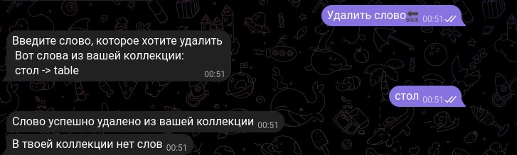
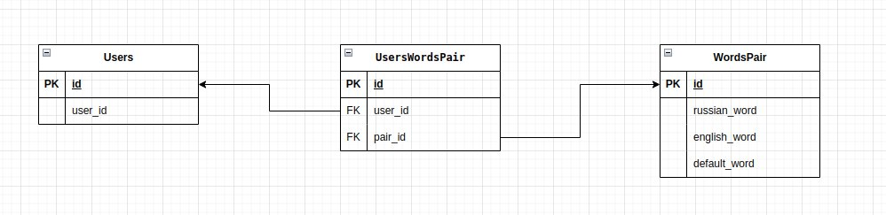

# Учитель английского, TG bot
Работа бота для нового пользователя начинается с приветственного сообщения. И бот предлагает угадать слово.
Изначально бот заполнен базовым набором слов(30 штук), они доступны всем пользователям.
Слова предлагаются рамдомно.

Слова бот предлагает на русском, нужно ввести или нажать на кнопку с правильным вариантом. При ошибке, будет предложено попробовать еще раз, а на неправильно варианте появится знак ❌.

## 1. Дальше
Когда пользователь угадал слово, нужно нажать на кнопку дальше, чтоб продолжить угадывать. Или он может выбрать другие кнопки: **добавить слово ➕**,  **удалить слово 🔙**. См пункты 2, 3.

## 2. Добавление
Чтобы добавить слово нужно нажать на кнопку **добавить слово ➕**. Сначала вводим его на русском, потом на английском. Добавление сопровождается сообщениями бота. 

Технология добавления слова см. пункт 4.

## 3. Удаление 
Чтобы удалить слово нужно нажать на кнопку **удалить слово 🔙**. При этом удалить можно только свое слово, поэтому выводится список слов пользователя и пользователь вводит нужное слово на русском или на английском(не важно). Если у пользователя своих слов нет, то он будет об этом предупрежден.

Можно сделать кнопки со словами пользователя, но с большими объемами (даже больше 15), это не удобно и громоздко.
Технология удаления слова см. пункт 4.

## 4. База данных

В базе данных 3 таблицы: пользователи, слова, связь пользователей и слов.

Для корректного удаления в таблице слов добавлен столбец default_words, который принимает значение True, если слово добавлено для общей базы, и False, если слово добавлено пользователем.

Благодаря этому пользователь может добавить себе в коллекцию даже то слово, которое есть в общем наборе(пользователь понятия не имеет какие слова есть в общем наборе, поэтому может добавить себе то слово, которое там уже есть). 

Так же при удалении слова. Пользователь удаляет только те слова, которые у него уже есть, даже если оно совпадает со словом из общего набора, то удалится слово с флагом default_word = False(т.е. слово добавленное пользователем).
